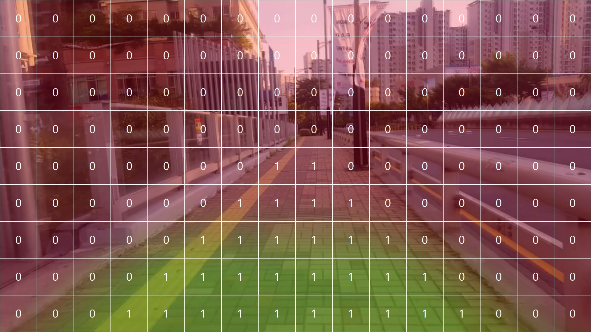

# Walk-Assistant
시각 장애인을 위한 보행로 인식 (Recognizing sidewalk for the visually impaired)

뉴스 참고: https://news.naver.com/main/read.nhn?mode=LSD&mid=sec&sid1=102&oid=025&aid=0002848946

TensorFlow Korea 참고: https://www.facebook.com/groups/TensorFlowKR/permalink/748798628794531/?__xts__[0]=68.ARA6-n9squLyI-_Kj09tjlLi3v7nQOcgWBYdqUGUTIlLm38kzfLx1GGUdcfjfKrC9aX74RGXWMRYUo-yVboKFj4_zZSqjihI5YR9v5K-LPn5hss2K50S5W5DKAqhS3vDoyGzNtUdDpY3ltq2T92sLsOa4LDF2hbogJkq3lE2TKDNMBwG06OA&__tn__=CH-R

오픈소스로 공개함으로써 이 프로젝트가 하루빨리 완성될 수 있으면 좋겠습니다.
학습 데이터가 절대적으로 부족합니다!
코드에 기여하지 않더라도 단순히 걸어다니면서 찍은 동영상을 공유하는것 만으로도 큰 도움이 됩니다!
클라우드를 지원받게 되면 공개 FTP 클라우드 서버를 만들어서 빅데이터를 모두가 같이 모을 수 있도록 하고자 합니다.

# 안전 범위
학습 방법의 핵심 아이디어는 "자전거(또는 사람)가 다니는 바로 앞부분은 안전할 것이다."라는 것입니다. (도로로 다니는 경우 제외)
즉, 라벨링 없이 학습을 할 수 있습니다.

영상을 찍을때 정면을 응시하고 수평선 높이로 맞추고 찍어야 합니다.

# 사용법
## 학습
python3 train.py [-h] [--video VIDEO] [--load LOAD] [--steps STEPS] [--epochs EPOCHS]

optional arguments:
  -h, --help       show this help message and exit
  --video VIDEO    input video 학습할 동영상 경로를 지정합니다. (기본값: data/test.mp4)
  --load LOAD      Load last weight 학습을 이어서 할지를 결정합니다. (기본값: False)
  --steps STEPS    Desired train steps, skips frames if smaller than video
                    동영상 중에서 몇개의 프레임을 학습할지를 지정합니다.
                    일정 프레임 단위로 건너뛰며 학습합니다.
  --epochs EPOCHS  Training epochs 몇번 학습할지 지정합니다.

## 예측
python3 predict.py [-h] [--out OUT] [--show SHOW] [--skip SKIP] video

positional arguments:
  video        input video path 예측할 입력 영상 경로를 지정합니다.

optional arguments:
  -h, --help   show this help message and exit
  --out OUT    output video save path 결과 동영상의 경로 (기본값: output/output.avi)
  --show SHOW  show real time video 화면에 opencv로 실시간으로 출력합니다. (기본값: False)
  --skip SKIP  skip frame to speed up 속도 향상을 위해 일정 프레임 단위로 건너 뜁니다. (기본값: 1 (1 프레임씩 건너뜀))

